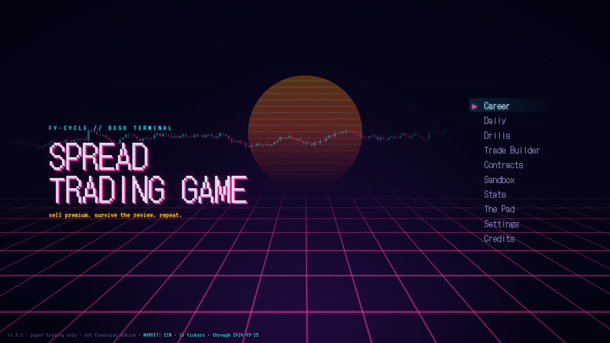
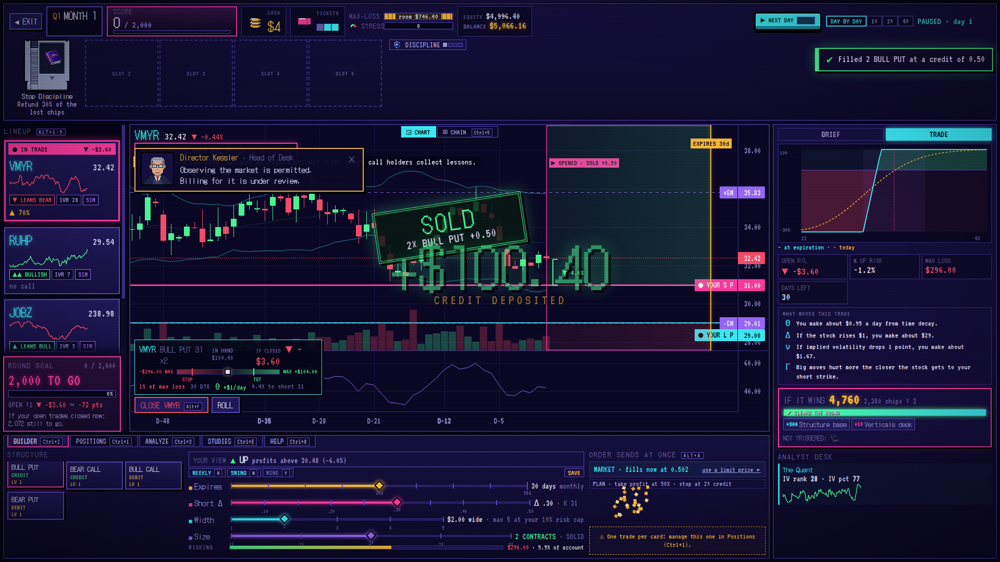
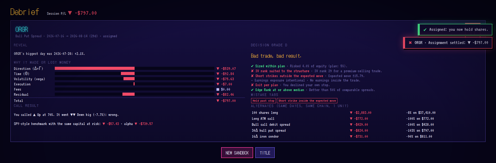
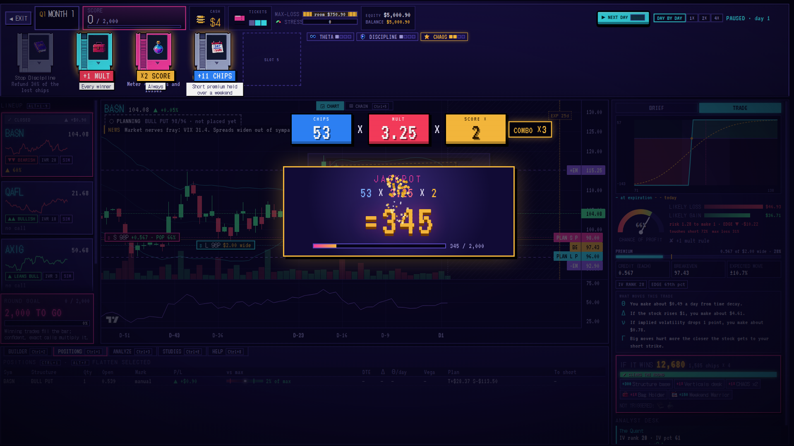
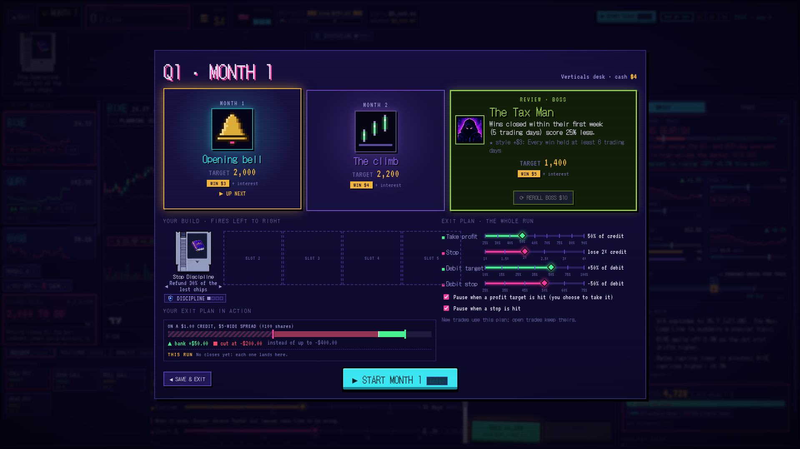
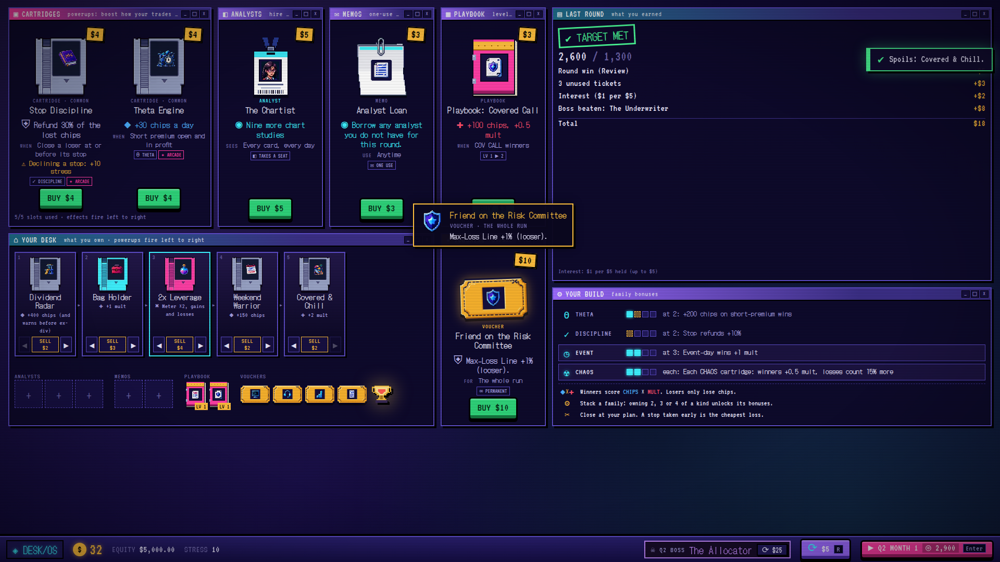
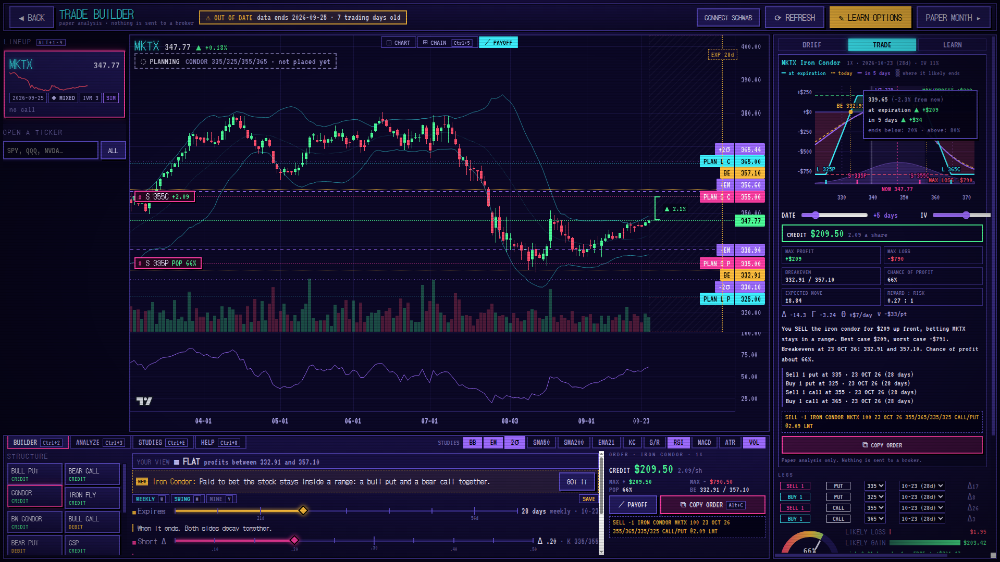
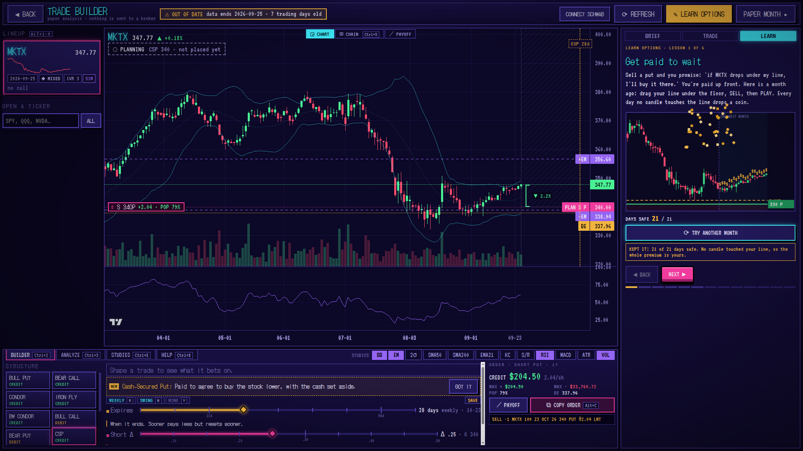

# Spread Trading Game

A free desktop paper-trading sandbox for options spreads (Windows and Mac). You trade historical option chains with real bid/ask spreads and real earnings reactions, and nothing is visible before its date. Each trade's P/L is broken down by Greek. A roguelite structure sits on top so the reps feel like a game, not homework.

**[Download the latest release](https://github.com/TTTrainer/Spread-Trade-Game/releases/latest)** · [How to install and play](README_PLAY.md) · Paper trading only; not financial advice.

## The trading screen

Pick a stock from the lineup, set expiration, short delta, width and size with sliders (or hotkeys), and sell the spread. The payoff, POP, expected move and what moves the trade (theta, delta, vega, gamma) update as you drag. Fills cross the real bid/ask.

## Why it made or lost money

Every closed trade is broken down day by day into direction (delta and gamma), time (theta), volatility (vega), execution and fees. Whatever the Greeks don't explain is shown as a residual, so the parts always add up to the real P/L. The debrief also grades the decision apart from the result and shows how other structures would have done on the same dates and chain.

## The game layer

A run is 12 monthly rounds (about 20–40 minutes) with score targets, a shop between rounds and bosses with their own rules. Cartridges (powerups) change your score, never the market. Each is tagged REAL (mirrors a real edge, like better fills inside the spread) or ARCADE (game-only). Taking a planned stop is rewarded; holding a loser past it costs you.

## Trade Builder and LEARN OPTIONS

The Trade Builder works on today's market. Build any of 14 strategies, read the full payoff with date and IV sliders, and copy the order as a thinkorswim-style line. Nothing is ever sent to a broker. LEARN OPTIONS is a short course on the chart you have open, starting with cash-secured puts and covered calls. It replays the weeks that followed against your strike.

## The data

- It starts on a simulated market (18 made-up companies with modeled option chains), so you can play right away.
- Real history is optional: **Settings → Data → BUILD REAL DATA** downloads DoltHub's free options, stocks, earnings and rates data (about 16 GB; needs about 40 GB free and a few hours) plus Cboe's VIX history. Options data starts in February 2019. Days the free data skipped are filled with a model and labeled **MODEL**.
- No lookahead: every request for market data goes through a time-gated layer that refuses anything after the simulated date. Earnings dates show ahead of time; results only on the day.
- Options data: [DoltHub post-no-preference/options](https://www.dolthub.com/repositories/post-no-preference/options) (CC BY-SA 4.0). Charts: [TradingView Lightweight Charts](https://www.tradingview.com/lightweight-charts/).

## Feedback

Playtesters welcome, especially people who trade spreads. Do the Greeks, POP, credit and breakevens match your broker's analyze tab? Do fills, assignment and expiration behave as you'd expect? Open an issue with what you saw.
