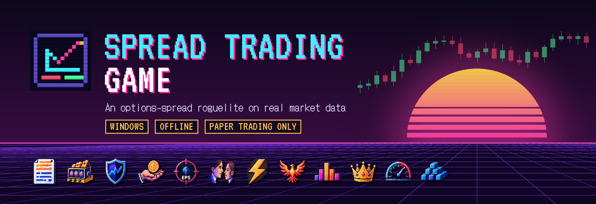

<p align="center">
  
</p>

<p align="center">
  <a href="https://github.com/TTTrainer/Spread-Trade-Game/releases/latest"></a>
  
  
</p>

<p align="center">
  <b>A Balatro-style roguelite about selling options spreads, played on real historical market data.</b><br>
  Call your shot, build the spread, watch the candles form, and take the stop before it takes you.
</p>

<p align="center">
  <a href="https://github.com/TTTrainer/Spread-Trade-Game/releases/latest"><b>⬇ Download for Windows</b></a> ·
  <a href="README_PLAY.md"><b>How to play</b></a> ·
  <a href="#-controls"><b>Controls</b></a>
</p>

---

> [!NOTE]
> Paper trading only. The game never touches a brokerage account, and nothing in it is financial advice.

## 🎮 What it is

Each **Career run** is one fiscal year: 12 short rounds, a shop between them, and targets that climb. Under the arcade layer is an honest market: real option chains, real earnings reactions and real P/L. Powerups change your score, cash and information, never the prices.

- **Call your shot.** Pick a direction and a confidence, and the game suggests the structure: bull put, bear call or iron condor.
- **Fast entry.** One-key presets (Weekly, Swing, your own), delta chips, and a draggable strike handle that shows credit and POP as you move it. A practiced trade takes under 10 seconds.
- **Watch it play out.** Each day's candle forms from open to close. P/L ticks live, and the game slows down and flashes "TESTING" when price nears your short strike.
- **Build your run.** Dozens of cartridges, analysts, memos and vouchers stack into combos. Each is tagged **REAL** (a real-world edge) or **ARCADE** (game-only).
- **Discipline pays.** Planned stops are rewarded and holding losers costs you. Every round ends with a debrief that explains each loss: direction, time decay, volatility, execution or a decision mistake.
- **More modes.** Tutorial, 60-second Drills, Daily challenges, client Contracts, Endless, and **Live** mode on this week's real market.

<p align="center">
  
  
  
  
  
  
  
</p>

## 🏦 The desks

| Desk | Plays |
|---|---|
| **Verticals** | Home desk. Bull put and bear call credit spreads, plus debit spreads when premium is cheap |
| **Income** | Covered calls, cash-secured puts and the wheel |
| **Condor** | Iron condors, iron flies and broken wings. Sell the range and defend it |
| **Volatility** | Long straddles and strangles. Buy movement before the market prices it |
| **Calendar** | Calendars, diagonals and double calendars |

Earn Bonus in runs to unlock new desks. The balance simulator keeps every desk within 10 points of Verticals' win rate.

## ⚖️ Balanced by simulation

Balance is tested by bots playing hundreds of headless runs, not tuned by feel ([full report](sim/REPORT.md)):

| Bot | Run win rate |
|---|---|
| Disciplined Seller | **58.5%** |
| Hold-to-Expiry | 23.5% |
| Greedy | 0.5% |
| Random | 0.0% |

Good process wins. Holding to expiry and greed lose.

## ⬇ Install

1. Download the **Setup** (installer) or **Portable** (no install) `.exe` from the [latest release](https://github.com/TTTrainer/Spread-Trade-Game/releases/latest).
2. If Windows shows "Windows protected your PC", click **More info → Run anyway**. The game isn't code-signed yet; this only happens once.
3. Play straight away on the built-in **SIM market** (18 invented companies). Real data is optional: **Settings → Data → BUILD REAL DATA** downloads free options history from DoltHub (about 16 GB, a few hours once).

The game runs offline and saves automatically. Full details, save locations and bug reporting are in **[README_PLAY.md](README_PLAY.md)**.

## ⌨ Controls

| Key | Action |
|---|---|
| `1`–`5` | Call your shot: down big → up big |
| `Shift+1`–`5` | Confidence 50%–90% |
| `Alt+S` / `Alt+B` | Sell (credit) / Buy (debit) |
| `Space` | Start or pause the day player |
| `R` / `K` | Reroll the lineup / skip the round |
| `Ctrl+1` / `2` / `3` | Positions / Builder / Analyze |
| `Ctrl+8` | Help and glossary |

Every key can be remapped, with a one-click reset to thinkorswim defaults.

## 🛠 Building from source

Requires Node.js LTS.

```bash
npm install
npm run dev          # launch in development mode
npm run verify       # typecheck, lint, unit tests
npm run sim -- --runs 2000   # balance simulation -> sim/REPORT.md
npm run build:win    # installer + portable exe -> release/
```

**Stack:** Electron, Vite, React and TypeScript · SQLite (better-sqlite3) · TradingView Lightweight Charts · PixiJS and Motion for effects · Tone.js for procedural synthwave music · Vitest and Playwright for tests.

## 🙏 Credits

- Options history: [DoltHub](https://www.dolthub.com/) public data (CC BY-SA 4.0)
- Charts: [TradingView Lightweight Charts](https://github.com/tradingview/lightweight-charts)
- Fonts: VT323 and DotGothic16 (SIL Open Font License)
